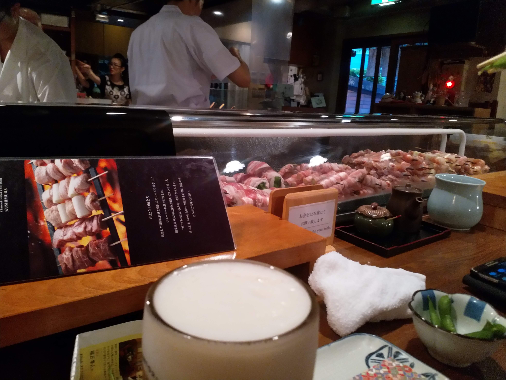
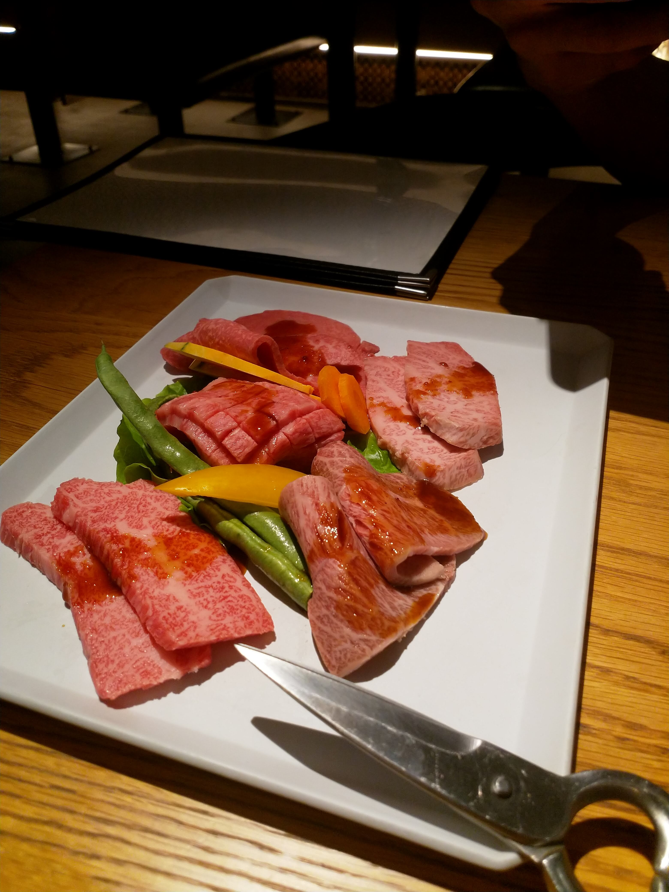
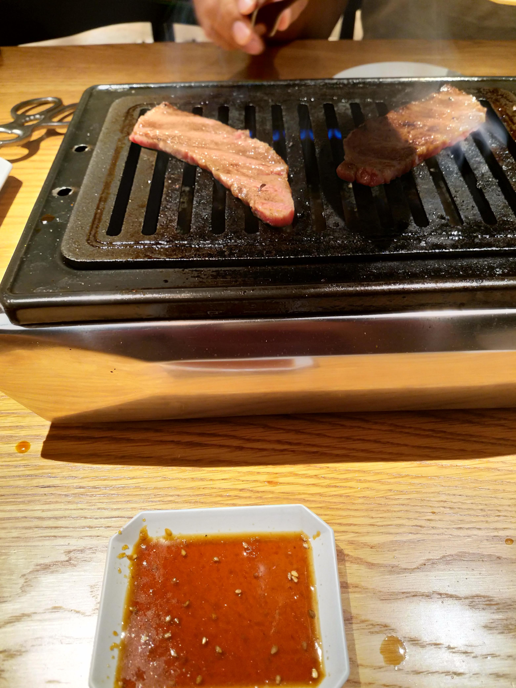

Till skillnad från läget i Sverige just nu så är jag aldrig långt ifrån en varm inbjudande grill. Dock är den inte utomhus, för här vill ingen egentligen vara utomhus.

## Yakitori, grillspett fast bra
Visst har det här hänt dig:

> Vi gör lite goa grillspett!

Säger kanske någon på nåt sånt där obehagligt grillparty som du då och då tvingas delta i. Hemma betyder detta att du kommer behöva gå igenom hela den hemska grilltändningsproceduren, bara för att sedan inte orka göra något vettigt av det hela och bara trä på några jäkla grönsaker och nån stackars köttbit på en pinne.

Här i Japan har de lite mer klass. Yakitori är kolgrill inomhus. Oftast jobbar de med kyckling, och det inkluderar samtliga delar av det fjädriga djuret.

Här kolgrillas det för fullt.

## Yakiniku, ett magiskt koncept

Här har vi ett koncept som aldrig, aldrig kommer att hända i Sverige. Och det är därför det är så bra.

Du har din egen grill. och du får små köttbitar som du kan grilla själv. Det finns såser du kan marinera med. På många ställen har de ett all you can eat-koncept där du betalar en summa för att äta hur mycket du vill i 120 minuter. Superstressigt. Och alldeles underbart. Som en extra bonus så finns det ofta ett all you can drink-koncept att komplettera med. Bara att sätta igång och grilla och dricka. Reservera tid på din närmaste toalett efteråt, för det kommer bli tufft när du kommer hem.

Lite gött wagyu-kött på väg.

Ut med det på grillen!

