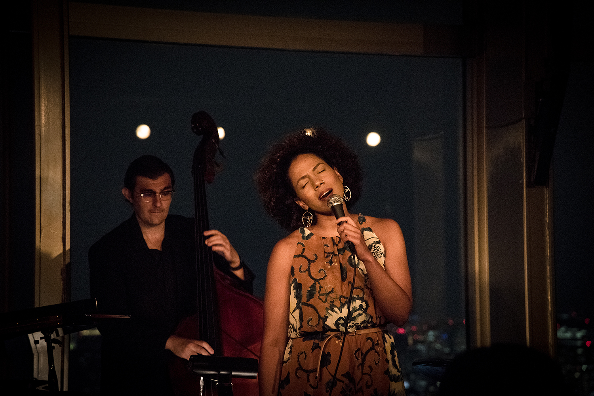

Likt många storstäder är Tokyo en dyr stad ur flera aspekter. Japan är allmänt ett land som är dyrare än de flesta länder i Asien, men priserna på boende, tjänster, saker och mat är liknande som i västvärlden. Dock anser jag att spannet mellan billigt och dyrt är större än de flesta städer jag rest till. Att äta ute är i de flesta fall billigare till liknande priser som finns i Sverige vilket är tur för oss då just äta ett utav de främsta syften vi har med den här resan. Sen finns det gott om ställen där en måltid skulle kunna bränna reskassan på en gång. Vi hade planerat två stycken sådana tillfällen där resekapitalet kunde sväva i fara - Ett besök på Park Hyatt Hotellet där vi tänkte ta oss några goda drinkar och sen snabbt ut igen. 

> När vi tog första steget in i lobbyn var det som att pengarna redan började ticka för varje andetag vi "lånade" hotellets luft.

Jag var förberedd på att det skulle bli ett dyrt besök, men efter att ha läst hotellet från filmen Lost in Translation blev jag intresserad av att besöka det och få en liknande upplevelse som i filmen. Därmed var det inte sagt att man inte får komma dit i vilka kläder som helst. Utan det råder relativt strikt klädskod då det är ett lyxhotell till att börja med där de "enklaste" rummen i skrivande stund startar på 35 000kr/natt.

Baren var belägen på högsta våningen ca 220 meter upp och när vi väl kom ut ur hissen möttes vi av en mäktig vy över Tokyo. Belysningen på hela våningen var aningen dämpat vilket gjorde att stadens luminans nästan var starkare vilket skapade en härlig atmosfär. Väl till bords fick vi några menyer där priserna på främst det ätbara artiklarna var ögonsvidande dyra. Vad sägs som 30 år lagrad Vintage Kaviar för 32 000kr. Nej tack! Föredrar hellre Kalles kaviar för 25kr. Vi var där för enbart drinkar och jag kan säga att mina två, som var en Mojito och en New Yorker inte gjorde smaklökarna besvikna, dock plånboken. Den har sen dess inte pratat med mig på hela dagen.

Under kvällen spelades härlig Jazzmusik som ackompanjerades med vacker sång. I slutändan blev det en dyr, men mycket trevlig kväll som man inte gör för ofta och vem vet om man någon gång kommer göra om det igen. Just därför ville jag göra det för att man vet aldrig när nästa tillfälle kommer.

Godnatt!
