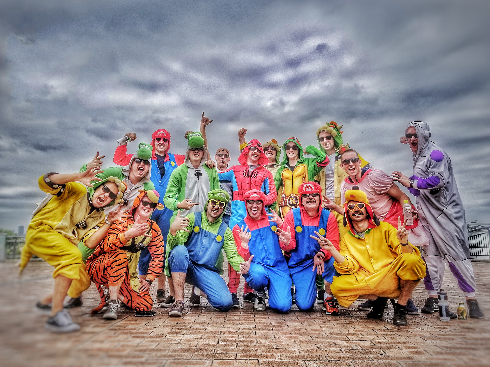

Just det! Häromdagen körde jag gokart iförd i en löjlig kostym liknande Bowser. Du vet den där onda taggiga sköldpaddan i Mario-spelen. Och det bästa är inte att jag fick köra gokart i den dräkten utan att hela evenemanget ägde rum på Tokyos gator! Helt sjukt! Det är som en gammal önskan från barndomen gick i uppfyllelse! De hela började med att jag läste att det fanns ett sådant evenemang i Tokyo nu när jag skulle resa dit. Så jag bokade en biljett och skaffade ett internationellt körkort för detta. Detta var ett krav då man faktiskt kör tillsammans med vanlig trafik på vägarna upp till 90 kilometer i timmen! Wow! Vilken upplevelse det var! Det var lite läskigt i början då jag varken kört gokart eller i vänstertrafik på väldigt länge. Andra hälften av nöjet var alla människor som såg en på gatan och stannade upp för att ta kort tillsammans med en! Det gav en kort känsla av att vara kändis, eller ja, kanske rättare sagt mer som en disneyfigur. Jag filmade stora delar av hela turen som jag senare kommer att klippa ihop till något mer vettigt.
Kort sagt, något jag verkligen rekommenderar alla som har körkort som planerar ett besök till Tokyo och som vill väcka sitt barnasinne till max och få en nostalgisk rusch. Jag kan säga att jag har aldrig varit med om någon så barnsligt rolig, men samtidigt cool upplevelse som denna! Only in Japan!

